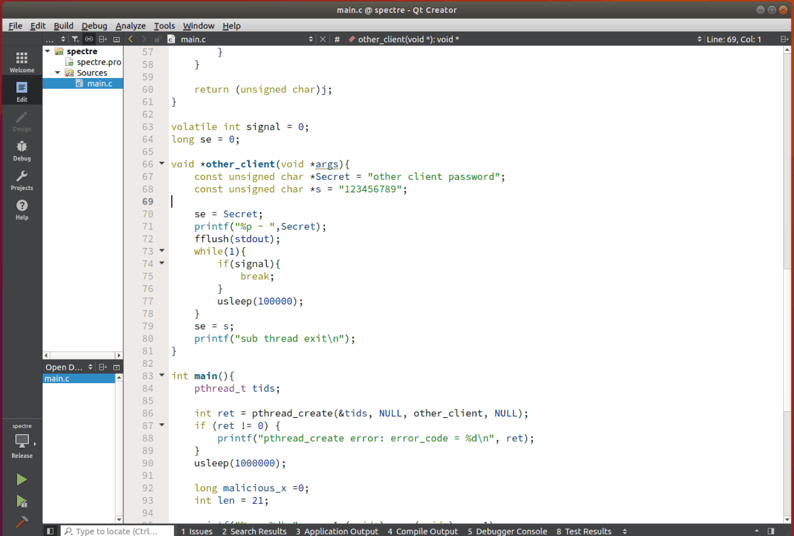
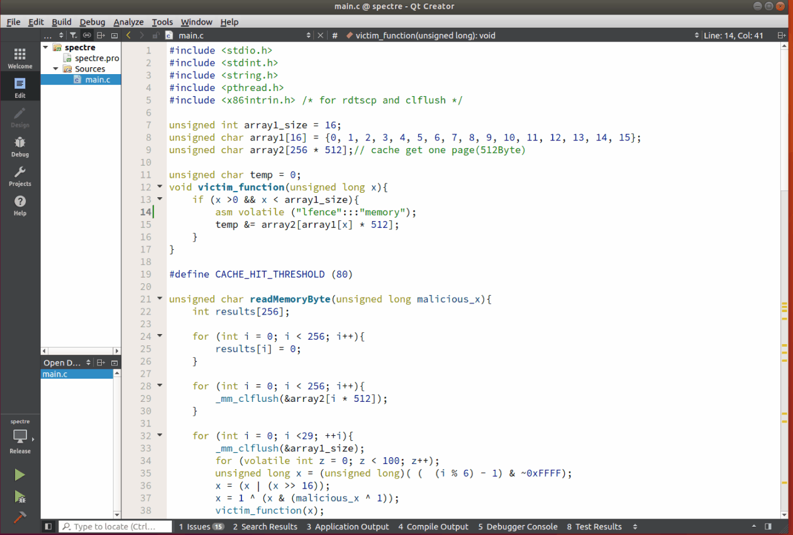

# Spectre-attack

Performed a Spectre-attack in the virtual environment.

* Based on branch prediction & cache position.
  
## Spectre-attack

## Solution

Add Assembler code

    asm volatile ("lfence":::"memory");

to prevent branch prediction.

